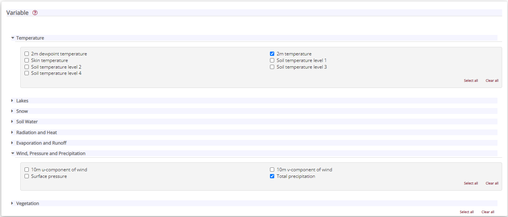
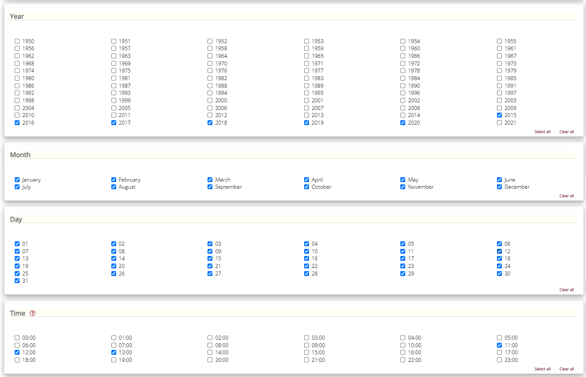
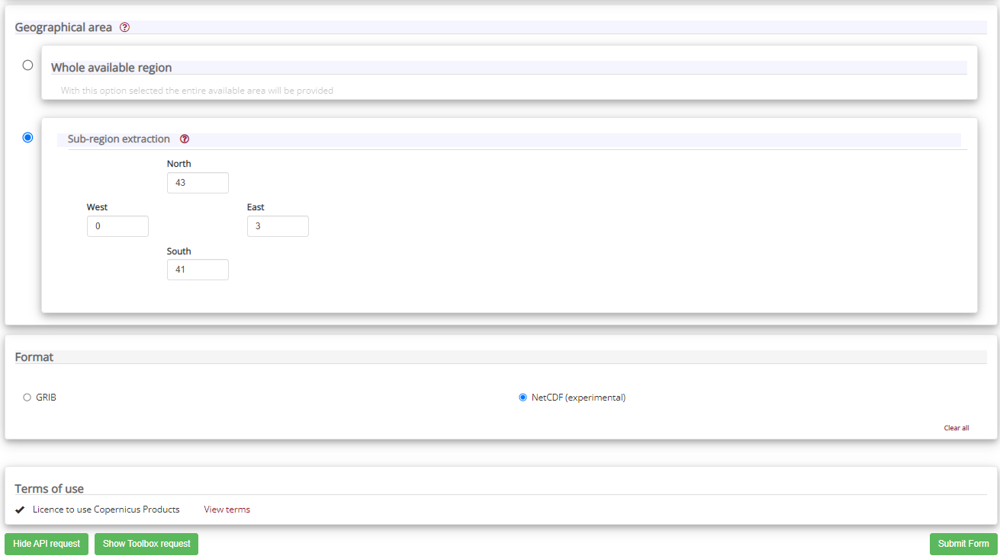

# **Local climate data extraction and visualization** 

## Description

This repository shows how to request, download, process, and visualize local climate data from ERA5 database, using two localities at Catalonia (NE Spain) as an example.  

## Repository structure  

**I.** The first section shows how to make a data request in Copernicus website, using the **python** code that the website creates for you.  

**II.** The second part shows how to read the .nc files downloaded and extract data for points/locations using **R**. 

**III.** The last section shows how to plot climate data using **climatographs** in **R**.


## Steps for ERA5 data request (using the [CDS API](https://cds.climate.copernicus.eu/api-how-to))

The following steps summarize how to make the ERA5 data request (for a detailed explanation see [this video](https://www.youtube.com/watch?v=cVtiVTSVdlo&t=237s)).  

1. Register in [Copernicus website](https://cds.climate.copernicus.eu/#!/home) to obtain access to the Climate Data Store (CDS).  

2. Create a local file with your user information:  

  * Open a text editor file and put the following lines:  
  
    url: https://cds.climate.copernicus.eu/api/v2  
    key: userID:api-key  
    
    <mark>You can find the userID and api-key at the end of the page by clicking on your user-name on the Copernicus website.</mark>   
    
  * Rename the created file to ".cdsapirc." (for *Windows*: the file must be in C:\Users\'your_user')

3. Go to the Copernicus website and select the data of interest:  

  * Select the [search tab](https://cds.climate.copernicus.eu/cdsapp#!/search) and search for the data you want to download (**ERA5** in this example).  
  
  * Select the specific data set (*e.g.* 'ERA5-Land hourly data from 1950 to present').  
  
  * In the **Download data** tab, select the data you want to download.  
  
    - For this example I selected **2m temperature** data from the Variable 'Temperature', and **Total precipitation** from the variable 'Wind, Pressure and Precipitation'.
    
     
    - I also specified years from 2015 to 2020, all months and days, and time from 11 h to 13 h for the sub-region '43, 0, 41, 3'.

    
    
    
  * Click on 'Show API request' buttom at the end of the page, and copy the code.  
  
4. Create a python file and run the request.

<mark>This step requires that you have *python* installed on your computer (follow [this steps](https://www.datacamp.com/community/tutorials/installing-anaconda-windows) to install it via [Conda](https://www.anaconda.com/products/individual)).</mark>    
  
  * Open the Anaconda Navigator and then a Jupyter Notebook (there are different ways to do this step, see [this example](https://problemsolvingwithpython.com/02-Jupyter-Notebooks/02.04-Opening-a-Jupyter-Notebook/#:~:text=Open%20a%20Jupyter%20Notebook%20with%20Anaconda%20Navigator,-One%20additional%20way&text=Open%20Anaconda%20Navigator%20using%20the,%2D%2D%3E%20%5BAnaconda%20Navigator%5D.&text=A%20Jupyter%20file%20browser%20will%20open%20in%20a%20web%20browser%20tab.&text=%3E%20%5BPython%203%5D-,A%20new%20notebook%20will%20open%20as,tab%20in%20your%20web%20browser.)) 
  
  * Add this code at the beginning of the jupyter notebook:  
  
    ```bash
    conda install -c conda-forge cdsapi
    ```
  
  * Paste the code from the API request in the jupyter notebook and run the [notebook](https://github.com/REDD1326/ERA5_extraction_and_visualization/tree/main/vignettes/ERA5download.ipynb). 


> If your data request includes several years and/or several variables, you could consider making one request per year/variable. The file [ERA5download_years.ipynb](https://github.com/REDD1326/ERA5_extraction_and_visualization/tree/main/vignettes/ERA5download_years.ipynb) shows how to modify the code from the API request to make a **request by year** and to print the status of the request. 

## Data processing in R

The file [ERA5_extraction.R](https://github.com/REDD1326/ERA5_extraction_and_visualization/blob/main/R/ERA5_extraction.R) shows how to process the downloaded .nc files using R. The code include the following procedure:  

* Read .nc files.  

* Apply the [brick_extract()](https://github.com/REDD1326/ERA5_extraction_and_visualization/blob/main/R/functions.R) function to extract data from .nc files and create a data frame by site.  

* Save the data in a .rds file by site.  

  - In case of multiple .nc files (by year/variable), the data will be saved for all years together per site. 

## Data visualization

In order to describe each location`s climate data I made a **Climatograph** by site (see the vignette [Climatograph](https://github.com/REDD1326/ERA5_extraction_and_visualization/blob/main/vignettes/Climatograph.Rmd)).

